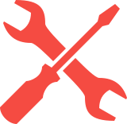

<!-- PROJECT LOGO -->
 

  
  <h3 align="center">Parelax</h3>

  

    Parelax
     
    <a href="https://github.com/MickeyUK/parelax/releases">Latest Release</a>
    ·
    <a href="https://github.com/MickeyUK/parelax/issues">Report Bug</a>
    ·
    <a href="https://github.com/MickeyUK/parelax/issues">Request Feature</a>
  

<!-- TABLE OF CONTENTS -->

  
<h2 style="display: inline-block">Table of Contents</h2>

  <ol>
    <li>
      <a href="#about-the-project">About The Project</a>
    </li>
    <li><a href="#license">License</a></li>
    <li><a href="#contact">Contact</a></li>
    <li><a href="#acknowledgements">Acknowledgements</a></li>
  </ol>

## About the Project

Welcome to Parelax, the ultimate application for gamers who love to play local multiplayer games online with friends, make new buddies, and build awesome communities! With Parelax, you can connect with gamers from around the world and enjoy your favorite local multiplayer games, no matter where you are.

Our platform allows you to easily invite friends to join your game, or find new players to join your squad. You can chat with your fellow gamers, share tips and tricks, and even build your own communities. Parelax is more than just a gaming platform, it's a community where gamers can come together to connect, play, and have fun.

So whether you're a casual gamer or a hardcore competitor, Parelax has something for you. Join our community today and experience the best of local multiplayer gaming, online!

<table>
    <tr>
        <td align="center">
           <a href="https://github.com/MickeyUK/parelax/releases">
               
               
Download

           </a>
           
Download latest version

        </td>
        <td align="center">
           <a href="https://github.com/MickeyUK/parelax/issues">
               
               
Issues

           </a>
           
Report issues and request features

        </td>
        <td align="center">
           <a href="https://discord.gg/9ZHmwce">
               
               
Discord

           </a>
           
Join the Discord community!

        </td>
        <td align="center">
           <a href="https://github.com/MickeyUK/parelax/wiki">
               
               
Wiki

           </a>
           
Read the full wiki guide here!

        </td>
    </tr>
</table>

## Contributing

See the [open issues](https://github.com/MickeyUK/parelax/issues) for a list of proposed features (and known issues).

Would you like to contribute to the project? That's great! Here's what you do:

1. Open a new issue reporting what you're going to do.
2. Fork this repository.
3. Create a branch for your feature.
4. Make your local changes.
5. Submit a pull request.

If you'd like to <a href="https://ko-fi.com/mickeyuk">buy me a coffee</a>, I won't say no!

## License

See `LICENSE.txt` for more information.

## Contact

Project Lead: [https://github.com/MickeyUK](https://github.com/MickeyUK)

<!-- ACKNOWLEDGEMENTS -->
## Acknowledgements

* [MickeyUK] - [GitHub](https://github.com/MickeyUK) - Smash Soda Project Lead
